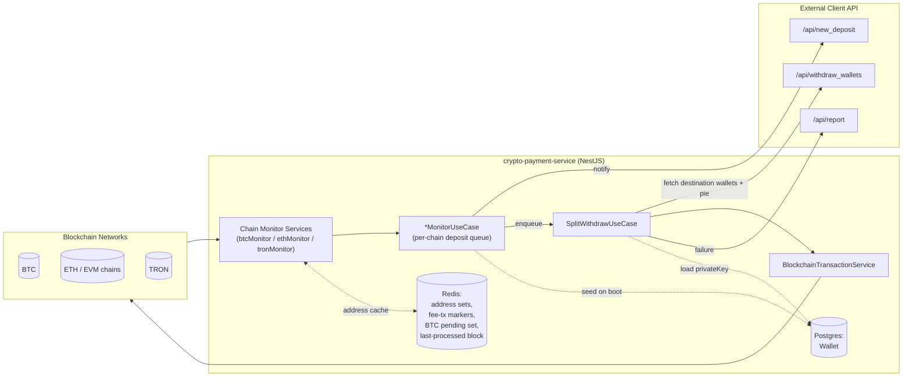

# ARCHITECTURE.md

## Scope

This document describes the fund-movement architecture of the crypto-payment-service: the path a deposit takes from on-chain detection on one of the three monitored chain families (BTC, ETH/EVM, TRON) through auto-split calculation to outbound withdrawal transactions, and the reliability patterns applied at each stage. It reflects the code as implemented in `src/`, not an idealized design.

## 1. System Context

The service runs as a single NestJS process (optionally PM2-clustered in production) that:

- Maintains long-lived connections/polling loops against three blockchain networks in parallel.
- Holds custody of source-wallet private keys, encrypted at rest (AES-256-CBC, `AESCipherService`).
- Delegates business decisions (destination wallets, split ratio) to an external system, the **client API** (`CLIENT_API_URL`), reached over HTTP.
- Persists only wallet records (address + encrypted private key + chain) to Postgres via TypeORM. Deposits are **not** persisted — `deposit.entity.ts` and `depositRepository.ts` are empty stubs. Redis is the only stateful store used during the deposit-to-withdrawal pipeline.

## 2. Fund-Movement Pipeline

The pipeline has five stages, executed per detected deposit. All three chain families implement the same conceptual stages with chain-specific detection mechanics (Stage 1) and chain-specific transaction signing (Stage 5).

### Stage 1 — Deposit Detection

Each chain has a dedicated infrastructure-layer monitor service that watches only addresses known to the service. The address allow-list is cached in Redis (`{chain}:address`, a Redis set) and re-seeded from Postgres on every application boot by the corresponding `*MonitorUseCase.onModuleInit`. This makes detection resilient to process restarts: the working set is rebuilt from the durable store (Postgres) rather than assumed to survive in Redis.

| Chain | Mechanism | File |
|---|---|---|
| ETH / EVM | `ethers.WebSocketProvider`, subscribes to new blocks and to the USDT `Transfer` event on the ERC-20 contract; inspects every transaction in each new block for a `to` address in the allow-list | `infrastructure/blockchain/eth/ethMonitor.service.ts` |
| TRON | HTTP polling of `tronWeb.trx.getBlock` every 3s, starting from `lastCheckedBlock`; decodes both native `TransferContract` and TRC-20 `TriggerSmartContract` calldata manually | `infrastructure/blockchain/tron/tronMonitor.service.ts` |
| BTC | HTTP polling (Blockbook/Ankr-style API) every 60s for new blocks; matching outputs are staged into a Redis pending set rather than reported immediately | `infrastructure/blockchain/btc/btcMonitor.service.ts` |

Only `Chain.ETH` monitoring is actually started (`EthMonitorUseCase.onModuleInit`); the other EVM networks (`EVM_BASE`, `EVM_BSC`, `EVM_POLYGON`, `EVM_ARBITRUM`, `EVM_OPTIMISM`, `EVM_AVALANCHE_C`, `EVM_FANTOM`) are wired through configuration and `EVM_CHAINS` but their `ethMonitorService.start(...)` calls are commented out.

Minimum-deposit thresholds are enforced at detection time (e.g. 0.001 ETH, 0.5 USDT, 1 TRX, 0.00005 BTC) to filter dust.

### Stage 2 — Confirmation Gating

Detection and confirmation are decoupled per chain:

- **BTC**: a matched output's txid is written to a Redis pending set (`btc:pending:txs`) at detection time. A separate polling pass (`checkPendingDeposits`, invoked on every 60s tick) re-queries each pending tx and only fires the deposit callback once `confirmations >= confirmationsThreshold` (2). The txid is then removed from the pending set — this Redis set is a durable work queue for "detected but not yet confirmed" deposits that survives a process restart, unlike an in-memory timer.
- **TRON**: confirmation is derived from block depth (`currentBlockNumber - blockNum + 1 >= confirmationThreshold`, currently 1) at the time the block is polled, not via a separate reconciliation pass.
- **ETH/EVM**: no explicit confirmation gate — a deposit is reported as soon as it appears in a fetched block. Reliability here relies on the WebSocket subscription's own block-emission timing rather than an app-level confirmation count.

### Stage 3 — Deposit Notification & Queuing

On a confirmed deposit, the use case layer (`*MonitorUseCase`) does two things:

1. Fire-and-forget notification to the external client API (`DepositService.notifyNewDeposit` → `POST /api/new_deposit`). Failure is logged and swallowed — it does not block withdrawal.
2. Hand the deposit off for withdrawal processing.

For ETH, this handoff goes through an **in-memory serial queue** (`depositQueue: Array<() => Promise<void>>`, drained by `processQueue`) so that multiple deposits landing in quick succession are processed one at a time per process instance, preventing concurrent withdrawal attempts (and therefore nonce/balance races) against the same or different source wallets. BTC and TRON invoke `SplitWithdrawUseCase.execute` directly without this queue.

This queue is in-memory only: it is not persisted, so an in-flight deposit is lost from the queue (though not from the chain) if the process crashes between detection and the point where `SplitWithdrawUseCase.execute` starts. Re-detection depends on the chain monitor re-scanning past state (BTC's pending set) or is not automatically retried (ETH, TRON).

### Stage 4 — Auto-Split Calculation

`SplitWithdrawUseCase.execute` (`application/usecases/autoWithdraw/splitWithdraw.usecase.ts`) orchestrates the split:

1. Calls the client API (`WithdrawService.getWithdrawWallets`, `GET /api/withdraw_wallets`) to obtain the destination `mainAddress`, `additionalAddress`, `mainPrivateKey` (for the destination's own fee wallet), and `pie` — the percentage split between the two destinations. This call is per-deposit; the split configuration is not cached, so it can change between deposits without a redeploy.
2. For TRON/USDT deposits, rents TRC-20 execution energy for the source address via `TronEnergyService` before moving funds (see Stage 5 fee handling).
3. Computes `{ mainAmount, additionalAmount } = splitAmountByPercentage(amount, pie)` — a pure percentage split of the full deposited amount.
4. Loads the source wallet's encrypted private key from Postgres and decrypts it implicitly at send time.
5. Executes up to two outbound transfers (additional, then main) via `withdrawAccount`.

If withdrawal wallet lookup fails or the source wallet record is missing, the flow aborts for that deposit and reports the failure; it does not retry from within this use case.

### Stage 5 — Outbound Transaction Dispatch & Fee/Gas Top-Up

`withdrawAccount` first attempts the transfer directly through `BlockchainTransactionService.sendFunds`, which dispatches by chain/currency to the chain-specific transaction service (`BtcTransactionService`, `EthTransactionService`, `TronTransactionService`). If the direct attempt fails (typically because the source wallet lacks native currency for gas/energy/bandwidth), the use case performs a **top-up-then-retry-once** pattern rather than failing immediately:

- **TRON**: sends 0.5 TRX from the destination's `mainPrivateKey` to the source address (`sendTrxForFeeOrActiveAccount`), then retries the withdrawal exactly once.
- **EVM chains**: estimates the required gas in ETH (`EthInfoService.getUSDTGasPriceInEth` / `getEthTransferGasPriceInEth`, falling back to a hardcoded 0.0007 ETH ceiling if estimation fails), sends that amount plus a small buffer from `mainPrivateKey` to the source address, marks the resulting tx hash in Redis (`addFeeTransactionHash`, 10-minute TTL) so the ETH monitor's block scanner recognizes and skips its own gas-funding transaction rather than misreading it as a customer deposit, then retries the withdrawal once.
- **BTC**: no top-up path is implemented; failure is reported directly.

A second failure after top-up (or any exception) is reported to the client API (`ReportService.sendReport` → `POST /api/report`) and logged; the use case returns without throwing, so a stuck withdrawal does not crash the process or block the deposit queue behind it.

## 3. Reliability Patterns in Use

| Pattern | Where | Purpose |
|---|---|---|
| **Serial per-process work queue** | `EthMonitorUseCase.depositQueue` / `processQueue` | Prevents concurrent withdrawal execution against the same source wallet from the same instance (avoids nonce collisions and double-spends of the same balance). |
| **Bounded retry with backoff** | `common/utils/retry.util.ts` (`withRetry`, used for ETH/TRON block fetches); `BtcInfoService.getBlockByHeightAllPages` (inline 3-attempt retry with linear backoff) | Absorbs transient RPC/HTTP failures when reading chain data without failing the whole polling cycle. |
| **WebSocket auto-reconnect** | `EthMonitorService.start` — `provider.on('error', ...)` and `provider.websocket.onerror` both tear down and recursively call `start(evmNetwork)` | Recovers the block/USDT-event subscription after a dropped WebSocket connection without manual intervention. |
| **Detect/confirm split with durable reconciliation queue** | BTC: Redis pending-tx set (`btc:pending:txs`) decoupling "seen in a block" from "has N confirmations" | Survives process restarts — pending confirmations are re-checked from Redis state rather than an in-memory timer. |
| **Confirmation thresholds** | BTC (2 confirmations), TRON (1 confirmation via block-depth) | Reduces the chance of acting on a deposit that is later reorganized out of the chain. |
| **Idempotency marker for self-generated transactions** | `RedisService.addFeeTransactionHash` / `isFeeTransactionHash`, checked in `EthMonitorService.checkBlockForDeposits` | Prevents the service's own gas-funding transfer to a source wallet from being misinterpreted as a new customer deposit and re-entering the pipeline. |
| **Address cache reseeded from durable storage on boot** | `*MonitorUseCase.onModuleInit` → `redisService.addAddress(chain, dbWallets)` | Redis (cache) can be flushed or restarted without losing the ability to recognize known deposit addresses, since Postgres remains authoritative. |
| **Top-up-then-retry for fee/energy exhaustion** | `SplitWithdrawUseCase.withdrawAccount`, `rentEnergy` | Handles the common failure mode of an empty source wallet (no gas/energy) without operator intervention, by funding it just enough to complete the withdrawal and retrying once. |
| **Fail-safe / fire-and-forget external reporting** | `ReportService.sendReport` called from every failure branch in `SplitWithdrawUseCase`; `DepositService.notifyNewDeposit` | Failures are surfaced to the external client API for operator visibility but never thrown, so a reporting failure or a single bad deposit cannot crash the monitor process or stall the queue. |
| **Per-unit error isolation** | try/catch around each transaction in `checkBlockForDeposits`/`pollDeposits`, around each queue task in `processQueue`, around each stage in `SplitWithdrawUseCase.execute` | A malformed or failing individual transaction/deposit does not abort the surrounding block/poll/queue iteration. |
| **On-chain confirmation wait before success** | `txResponse.wait()` (EVM), `TronInfoService.waitForTronTxConfirmation` (polls up to 1200×1s) | Outbound transfers are only reported as successful once mined/confirmed, not merely broadcast. |
| **Balance-aware amount clamping** | `EthTransactionService.sendETH` — reduces `amountWei` to `balance - totalGasWithBuffer` if the requested amount plus a 25% gas buffer would exceed the balance | Avoids broadcasting a transaction that would be rejected for insufficient funds once gas is accounted for. |
| **Encryption at rest for custodial key material** | `AESCipherService` (AES-256-CBC, scrypt-derived key, random IV per encryption) applied to `Wallet.privateKey` | Limits blast radius of a Postgres-only data compromise; keys are only decrypted in memory at send time. |

## 4. Known Reliability Gaps

These are structural limitations of the current implementation, relevant to any future work on this pipeline:

- **No durable deposit/withdrawal ledger.** Deposits are not persisted (`deposit.entity.ts` is an empty stub); the only record of an in-flight deposit is the in-memory queue (ETH) or Redis pending set (BTC) plus whatever the external client API stores. A crash between detection and successful withdrawal is not automatically recovered for ETH/TRON.
- **No distributed queue or broker.** The deposit queue is a process-local array. In a multi-instance (PM2 cluster) deployment, only the instance whose monitor detects the block processes that deposit — there is no shared work queue coordinating across instances, and no instance-level failover for an in-flight item.
- **`synchronize: true` with no migrations.** Schema changes to `Wallet` apply automatically on boot; there is no migration history or rollback path.
- **Auth guards disabled.** `ApiKeyGuard` and `IpWhitelistGuard` exist but are commented out on `WalletController`, so wallet management is currently unauthenticated at the HTTP layer (outside the scope of the fund-movement pipeline itself, but relevant to the integrity of the address set it consumes).
- **Only `Chain.ETH` is actually monitored** despite EVM sibling chains being fully configured; enabling them is a matter of uncommenting `ethMonitorService.start(...)` calls, but each additional chain adds another independent WebSocket subscription and reconnect loop to operate.
