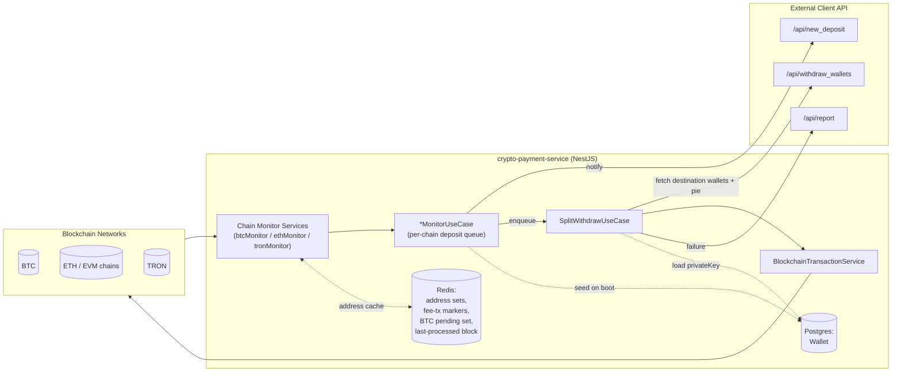

# ARCHITECTURE.md

## Scope

This document describes the fund-movement architecture of the crypto-payment-service: the path a deposit takes from on-chain detection on one of the three monitored chain families (BTC, ETH/EVM, TRON) through auto-split calculation to outbound withdrawal transactions, and the reliability patterns applied at each stage. It reflects the code as implemented in `src/`, not an idealized design.

## 1. System Context

The service runs as a single NestJS process (optionally PM2-clustered in production) that:

- Maintains long-lived connections/polling loops against three blockchain networks in parallel.
- Holds custody of source-wallet private keys, encrypted at rest (AES-256-GCM with a per-record salt, `AESCipherService`). Legacy AES-256-CBC (`v1`) envelopes still decrypt for migration.
- Delegates business decisions (destination wallets, split ratio) to an external system, the **client API** (`CLIENT_API_URL`), reached over HTTP.
- Persists wallet records, a **deposit ledger** (`Deposit`) and per-chain scan checkpoints (`ChainCheckpoint`) to Postgres via TypeORM. The deposit ledger is written before any funds move and is both the crash-recovery record and the idempotency key. Redis is a cache and a coordination primitive, not a source of truth.

## 2. Fund-Movement Pipeline

The pipeline has five stages, executed per detected deposit. All three chain families implement the same conceptual stages with chain-specific detection mechanics (Stage 1) and chain-specific transaction signing (Stage 5).

### Stage 1 — Deposit Detection

Each chain has a dedicated infrastructure-layer monitor service that watches only addresses known to the service. The address allow-list is cached in Redis (`{chain}:address`, a Redis set) and re-seeded from Postgres on every application boot by the corresponding `*MonitorUseCase.onModuleInit`. This makes detection resilient to process restarts: the working set is rebuilt from the durable store (Postgres) rather than assumed to survive in Redis.

| Chain | Mechanism | File |
|---|---|---|
| ETH / EVM | `ethers.WebSocketProvider` subscribes to new heads, but scans only blocks buried under the confirmation depth. Native transfers come from the block body; USDT transfers from `eth_getLogs` over the same confirmed block, so both share one confirmation rule and one checkpoint | `infrastructure/blockchain/eth/ethMonitor.service.ts` |
| TRON | HTTP polling of `tronWeb.trx.getBlock` every 3s, starting from `lastCheckedBlock`; decodes both native `TransferContract` and TRC-20 `TriggerSmartContract` calldata manually | `infrastructure/blockchain/tron/tronMonitor.service.ts` |
| BTC | HTTP polling (Blockbook/Ankr-style API) every 60s for new blocks; matching outputs are staged into a Redis pending set rather than reported immediately | `infrastructure/blockchain/btc/btcMonitor.service.ts` |

Which EVM networks are monitored is configuration (`ENABLED_EVM_NETWORKS`, default `ETH`). Each additional network adds an independent WebSocket subscription and reconnect loop to operate.

Minimum-deposit thresholds are enforced at detection time (e.g. 0.001 ETH, 0.5 USDT, 1 TRX, 0.00005 BTC) to filter dust.

### Stage 2 — Confirmation Gating

Detection and confirmation are decoupled per chain:

- **BTC**: a matched output's txid is written to a Redis pending set (`btc:pending:txs`) at detection time. A separate polling pass (`checkPendingDeposits`, invoked on every 60s tick) re-queries each pending tx and only fires the deposit callback once `confirmations >= confirmationsThreshold` (2). The txid is then removed from the pending set — this Redis set is a durable work queue for "detected but not yet confirmed" deposits that survives a process restart, unlike an in-memory timer.
- **TRON**: only blocks at or below `currentBlockNumber - confirmations + 1` are scanned (default 19, TRON's irreversibility depth). Shallower blocks are left for a later poll.
- **ETH/EVM**: the scanner targets `head - confirmations` (default 12 on mainnet, per-chain elsewhere) and advances through the range, so a missed head notification cannot skip a block.

Depth is the primary reorg protection. Each deposit also stores the `blockHash`/`blockNumber` it was seen at, so a reorg can be detected after the fact; re-validating the block hash immediately before sweeping is **not** implemented.

### Stage 3 — Deposit Notification & Queuing

On a confirmed deposit, the use case layer (`*MonitorUseCase`) does two things:

All three chains funnel into `ProcessDepositUseCase`, which enforces the ordering that makes the pipeline recoverable:

1. **Record.** Insert the `Deposit` row before anything moves.
2. **Claim atomically.** `ON CONFLICT DO NOTHING` against the `(chain, txHash, address, outputIndex)` unique key. A re-delivered deposit — duplicated listener, overlapping poll, restart mid-flight, second instance — collapses onto the existing row.
3. **Notify** the client API (fire-and-forget, recorded in `clientNotifiedAt`; reconciliation re-sends anything unacknowledged, making delivery at-least-once).
4. **Check outflow limits.** A deposit over the per-deposit ceiling or the rolling hourly total is recorded `HELD` for manual release instead of swept.
5. **Compare-and-swap `DETECTED -> SWEEPING`**, so exactly one worker proceeds to move funds.
6. **Sweep, then record the outcome** (`SWEPT` / `FAILED` with a reason).

Each chain has its own bounded `SerialQueue`, so deposits are swept one at a time per chain — concurrent sweeps race on the shared fee wallet's nonce and balance. The queue is in-memory, but losing it is no longer lossy: the scan checkpoint has not advanced past an unprocessed deposit, so it is re-detected, and the ledger makes re-detection idempotent.

### Stage 4 — Auto-Split Calculation

`SplitWithdrawUseCase.execute` (`application/usecases/autoWithdraw/splitWithdraw.usecase.ts`) orchestrates the split:

1. Calls the client API (`WithdrawService.getWithdrawWallets`, `GET /api/withdraw_wallets`) to obtain the destination `mainAddress`, `additionalAddress`, `mainPrivateKey` (for the destination's own fee wallet), and `pie` — the percentage split between the two destinations. This call is per-deposit; the split configuration is not cached, so it can change between deposits without a redeploy.
2. For TRON/USDT deposits, rents TRC-20 execution energy for the source address via `TronEnergyService` before moving funds (see Stage 5 fee handling).
3. Computes `{ mainAmount, additionalAmount } = splitAmountByPercentage(amount, pie)` in basis points on `bigint`. The additional leg truncates down and the main leg takes the remainder, so the two always sum to the deposit exactly; the invariant is asserted at runtime.
4. Loads the source wallet from Postgres by `(address, chain)` and decrypts its private key in memory at send time.
5. Executes the transfers. On BTC both legs share a **single transaction**, so the split is atomic. Elsewhere the additional leg runs first and its result gates the main leg; a main-leg failure after the additional leg landed is reported distinctly as `PARTIAL SWEEP`.

If withdrawal wallet lookup fails or the source wallet record is missing, the flow aborts for that deposit and reports the failure; it does not retry from within this use case.

### Stage 5 — Outbound Transaction Dispatch & Fee/Gas Top-Up

`withdrawAccount` first attempts the transfer directly through `BlockchainTransactionService.sendFunds`, which dispatches by chain/currency to the chain-specific transaction service (`BtcTransactionService`, `EthTransactionService`, `TronTransactionService`). If the direct attempt fails (typically because the source wallet lacks native currency for gas/energy/bandwidth), the use case performs a **top-up-then-retry-once** pattern rather than failing immediately:

- **TRON**: sends 0.5 TRX from the destination's `mainPrivateKey` to the source address (`sendTrxForFeeOrActiveAccount`), then retries the withdrawal exactly once.
- **EVM chains**: estimates the required gas in ETH (`EthInfoService.getUSDTGasPriceInEth` / `getEthTransferGasPriceInEth`, falling back to a hardcoded 0.0007 ETH ceiling if estimation fails), sends that amount plus a small buffer from `mainPrivateKey` to the source address, marks the resulting tx hash in Redis (`addFeeTransactionHash`, 10-minute TTL) so the ETH monitor's block scanner recognizes and skips its own gas-funding transaction rather than misreading it as a customer deposit, then retries the withdrawal once.
- **BTC**: no top-up path is implemented; failure is reported directly.

Sends return a typed `SendOutcome`, so the top-up-and-retry only runs for failures that funding can actually fix. A terminal failure (malformed address, reverted call) is reported immediately rather than burning a gas transfer on a doomed retry.

A second failure after top-up (or any exception) is reported to the client API (`ReportService.sendReport` → `POST /api/report`) and logged; the use case returns without throwing, so a stuck withdrawal does not crash the process or block the deposit queue behind it.

## 3. Reliability Patterns in Use

| Pattern | Where | Purpose |
|---|---|---|
| **Serial per-process work queue** | `EthMonitorUseCase.depositQueue` / `processQueue` | Prevents concurrent withdrawal execution against the same source wallet from the same instance (avoids nonce collisions and double-spends of the same balance). |
| **Bounded retry with backoff** | `common/utils/retry.util.ts` (`withRetry`, used for ETH/TRON block fetches); `BtcInfoService.getBlockByHeightAllPages` (inline 3-attempt retry with linear backoff) | Absorbs transient RPC/HTTP failures when reading chain data without failing the whole polling cycle. |
| **Guarded WebSocket reconnect** | `EthMonitorService.scheduleReconnect` — one provider per network, one reconnect in flight, exponential backoff with jitter and an attempt cap | Recovers a dropped subscription without spawning duplicate providers (each of which would re-report every deposit). |
| **Detect/confirm split with durable reconciliation queue** | BTC: Redis pending-tx set (`btc:pending:txs`) decoupling "seen in a block" from "has N confirmations" | Survives process restarts — pending confirmations are re-checked from Redis state rather than an in-memory timer. |
| **Confirmation thresholds** | Per-chain and config-driven: BTC 2, TRON 19, ETH 12, per-chain for EVM siblings | Reduces the chance of acting on a deposit that is later reorganized out of the chain. |
| **Durable deposit ledger with atomic claim** | `Deposit` + `ProcessDepositUseCase` | Crash recovery, idempotency and reconciliation all rest on this one row. |
| **Durable scan checkpoints** | `ChainCheckpoint`, advanced only after a block is fully processed | Downtime becomes a gap that gets re-scanned rather than deposits lost forever. |
| **Bounded serial queue per chain** | `SerialQueue` | One sweep at a time per chain, with backpressure instead of unbounded growth. |
| **Automated-outflow limits** | `ProcessDepositUseCase.checkSweepLimits` | A per-deposit ceiling and a rolling hourly total; over either, the deposit is `HELD` for a human. |
| **Ledger-vs-chain reconciliation** | `ReconcileDepositsUseCase` | Detects stuck, failed and held deposits and funds still sitting at a source address. |
| **RPC failover with quorum** | `EvmProviderFactory` | A single compromised or failing endpoint cannot by itself convince the service a deposit exists. |
| **Idempotency marker for self-generated transactions** | `RedisService.addFeeTransactionHash` / `isFeeTransactionHash`, checked in `EthMonitorService.checkBlockForDeposits` | Prevents the service's own gas-funding transfer to a source wallet from being misinterpreted as a new customer deposit and re-entering the pipeline. |
| **Address cache reseeded from durable storage on boot** | `*MonitorUseCase.onModuleInit` → `redisService.addAddress(chain, dbWallets)` | Redis (cache) can be flushed or restarted without losing the ability to recognize known deposit addresses, since Postgres remains authoritative. |
| **Top-up-then-retry for fee/energy exhaustion** | `SplitWithdrawUseCase.withdrawAccount`, `rentEnergy` | Handles the common failure mode of an empty source wallet (no gas/energy) without operator intervention, by funding it just enough to complete the withdrawal and retrying once. |
| **Fail-safe / fire-and-forget external reporting** | `ReportService.sendReport` called from every failure branch in `SplitWithdrawUseCase`; `DepositService.notifyNewDeposit` | Failures are surfaced to the external client API for operator visibility but never thrown, so a reporting failure or a single bad deposit cannot crash the monitor process or stall the queue. |
| **Per-unit error isolation** | try/catch around each transaction in `checkBlockForDeposits`/`pollDeposits`, around each queue task in `processQueue`, around each stage in `SplitWithdrawUseCase.execute` | A malformed or failing individual transaction/deposit does not abort the surrounding block/poll/queue iteration. |
| **On-chain confirmation wait before success** | `txResponse.wait()` (EVM), `TronInfoService.waitForTronTxConfirmation` (polls up to 1200×1s) | Outbound transfers are only reported as successful once mined/confirmed, not merely broadcast. |
| **Fail-loud on insufficient funds** | All three `send*` implementations | A wallet that cannot cover the requested amount produces a typed failure, never a silently reduced transfer reported as success. |
| **Encryption at rest for custodial key material** | `AESCipherService` (AES-256-GCM, per-record salt, HKDF-derived key from a scrypt-stretched master) applied to `Wallet.privateKey` | Limits blast radius of a Postgres-only data compromise; tampering fails closed on the auth tag; keys are decrypted only in memory at send time. |

## 4. Known Reliability Gaps

Structural limitations that remain after the remediation pass, relevant to any future work:

- **No shared work broker.** Each instance still has a process-local queue. `MONITOR_LEADER_ELECTION` ensures only one instance scans, and the ledger makes duplicate detection harmless, but there is no cross-instance failover for an in-flight sweep: a deposit left `SWEEPING` by a crashed instance needs human reconciliation, never a blind retry.
- **No reorg re-validation before sweeping.** Confirmation depth is the protection; the stored `blockHash` enables after-the-fact detection but nothing re-checks it at send time.
- **The destination hot-wallet key still crosses a network boundary.** `withdraw_wallets` returns it per deposit. The transport is now authenticated, TLS-enforced and validated, but the correct fix is signing locally or via a signing service.
- **The sweep amount is the deposit amount, not the on-chain balance.** If a wallet holds a prior balance, that residue is not swept; reconciliation reports it rather than moving it, because changing what is swept alters the accounting already reported to the client API.
- **The baseline migration is unverified** against a real Postgres.
- **No end-to-end test coverage.** Booting `AppModule` requires live Postgres and Redis.
