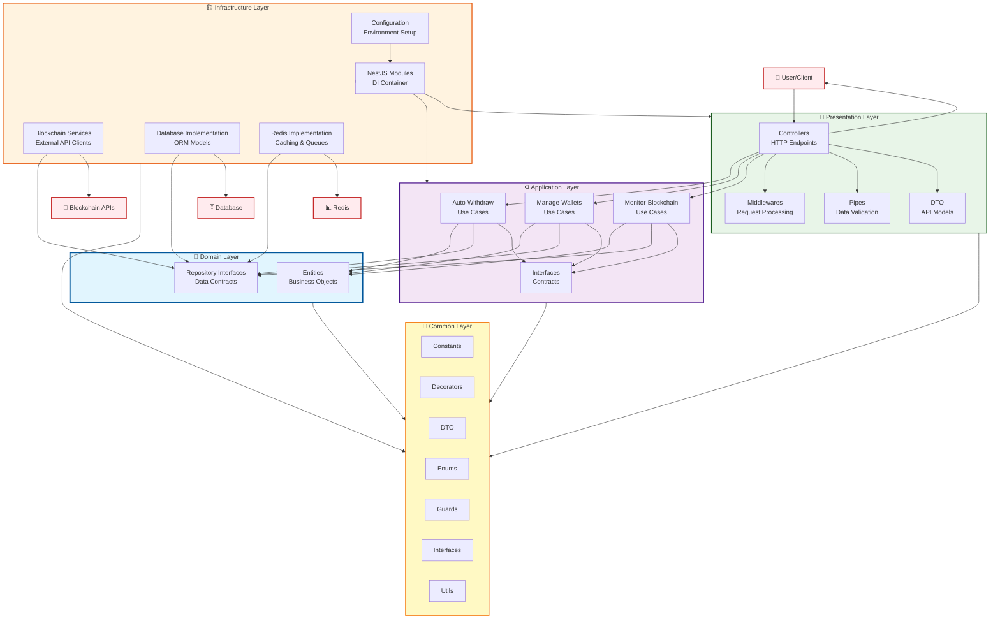

# 💳 Crypto Payment Service

## 💡 Что делает этот продукт

**Это платёжный шлюз для приёма криптовалюты** — готовая инфраструктура, которая позволяет любому онлайн-бизнесу принимать платежи в криптовалюте так же просто, как оплату картой: клиент переводит деньги, система сама фиксирует поступление, уведомляет ваш сервис и мгновенно перемещает средства на защищённые счета компании.

По сути это «собственный Stripe для крипты», работающий под полным контролем владельца — **без комиссии посредника и без передачи денег третьей стороне**.

---

## 🎯 Какую проблему он решает

Любая компания, которая хочет принимать криптоплатежи, упирается в одну из двух стен: платить процент внешнему провайдеру или строить собственную инфраструктуру годами. Этот продукт убирает обе.

**Боль №1. Комиссия посредника съедает маржу**

- Внешние криптопроцессинги удерживают процент с каждой транзакции — на объёме это прямой отток прибыли.
- Здесь весь оборот проходит через инфраструктуру компании: платёжный поток остаётся внутри бизнеса.

**Боль №2. Деньги клиента можно потерять или не заметить**

- Криптоперевод не приходит «на счёт» — его нужно самому увидеть в сети. Ручная сверка означает задержки, жалобы и потерянные платежи.
- Система следит за поступлениями непрерывно и в реальном времени, фиксируя каждый платёж вплоть до подтверждения сетью.

**Боль №3. Средства размазаны по тысячам адресов**

- Каждый клиент платит на свой отдельный адрес. Без автоматизации бухгалтерия получает «пыль» на тысячах кошельков, которую невозможно ни посчитать, ни использовать.
- Продукт автоматически собирает все поступления на казначейские счета компании — сразу после платежа, без участия человека.

**Боль №4. Комиссии сети и «мёртвые» переводы**

- Чтобы отправить деньги с адреса клиента, на нём должна быть комиссия сети — иначе перевод физически невозможен, и средства зависают.
- Система сама рассчитывает и заранее доставляет нужную комиссию на каждый адрес, а в сети TRON — арендует ресурс вместо прямой оплаты, что заметно дешевле стандартного сжигания монет.

**Боль №5. Зависимость от одной сети**

- Клиенты платят там, где им удобно. Поддержка только одной сети = потерянные платежи.
- Поддерживается **10 блокчейн-сетей** (Bitcoin, Ethereum, TRON, BNB Chain, Polygon, Base, Arbitrum, Optimism, Avalanche, Fantom) и **4 валюты**, включая USDT — самый популярный стейблкоин для расчётов.

---

## ⚙️ Как это работает (на пальцах)

Система работает как автоматический кассир, который круглосуточно, без выходных, дежурит у всех платёжных «касс» одновременно.

**Главный сценарий — от платежа клиента до денег в казне:**

1. **Выдача реквизитов.** Ваша платформа запрашивает у системы платёжный адрес для клиента. Система проверяет корректность реквизитов и ставит адрес под наблюдение.
2. **Ожидание платежа.** С этого момента адрес отслеживается непрерывно — система видит новые операции в сети практически в момент их появления, а не по расписанию.
3. **Фиксация поступления.** Как только клиент перевёл деньги, платёж распознаётся, проверяется на минимальную сумму и подтверждается сетью. Мелкий «мусорный» трафик отсекается автоматически.
4. **Мгновенное уведомление.** Ваша основная платформа сразу получает сигнал о поступлении — заказ можно закрывать, баланс пополнять, товар отгружать. Клиент не ждёт.
5. **Автоматический сбор средств.** Не дожидаясь ручных действий, система переводит поступившие деньги с адреса клиента на казначейские счета компании — **распределяя сумму между основным и резервным счётом в заданной вами пропорции**. Деньги не лежат без движения и не остаются на «горячих» адресах.
6. **Самовосстановление.** Если перевод не прошёл из-за нехватки комиссии — система сама пополняет её и повторяет операцию. Если что-то пошло не так — команда немедленно получает отчёт об инциденте, а не узнаёт о проблеме от клиента.

**Что это даёт бизнесу:**

- 🔓 **Полный контроль над деньгами** — средства проходят только через инфраструктуру компании, без хранения у посредника.
- ⚡ **Платежи зачисляются без участия человека** — от перевода клиента до денег в казне не требуется ни одного ручного действия.
- 🔐 **Ключи доступа к средствам хранятся в зашифрованном виде**, доступ к системе ограничен по ключу и списку разрешённых адресов.
- 📈 **Готовность к росту** — сеть или валюта добавляется как модуль, без переписывания системы; нагрузка масштабируется горизонтально.
- 🧩 **Встраивается в существующий бизнес** — работает как отдельный сервис, подключается к вашей платформе за считанные интеграционные точки.

---

# 🏗 Техническая архитектура

_Реализовано с помощью **Clean Architecture** и **Hexagonal Pattern**_

---

## 🗂 1. `application/`

> **Назначение:**  
> _Слой бизнес-логики (Application Layer). Здесь оформляются сценарии использования (use cases), которые координируют работу между доменом и инфраструктурой._

### 📁 Содержимое:

- #### `interfaces/`

  - **Что это:** Интерфейсы для сценариев использования, сервисов, портов и т. д.
  - **Пример:**
    - `IWithdrawService`
    - `IWalletManager`

- #### `usecases/`
  - **Что это:** Реализация бизнес-сценариев (use cases).
  - 📂 **Подпапки:**
    1. **`auto-withdraw/`**
       - _Логика автоматического вывода средств:_
         - Автоматизация переводов
         - Проверка лимитов и т. д.
    2. **`manage-wallets/`**
       - _Сценарии управления кошельками:_
         - Создание кошелька
         - Удаление кошелька
         - Обновление кошелька
         - Получение информации о кошельках
    3. **`monitor-blockchain/`**
       - _Сценарии мониторинга блокчейна:_
         - Отслеживание входящих транзакций
         - Мониторинг подтверждений
         - И другие задачи, связанные с реакцией на события блокчейна

---

## 🛠 2. `common/`

> **Назначение:**  
> _Общие компоненты, используемые во всём проекте. Это слой переиспользуемых сущностей, утилит и вспомогательных конструкций._

### 📁 Содержимое:

- #### `constants/`

  - **Константы:** Magic numbers, строки ошибок, ключи конфигурации и т. д.

- #### `decorators/`

  - **Кастомные декораторы:**
    - Для валидации
    - Для авторизации
    - Для логирования

- #### `dto/`

  - **Data Transfer Objects (DTO):** Структуры, которые описывают, как данные передаются между слоями (например, запросы и ответы API).

- #### `enums/`

  - **Перечисления:** Статусы, типы, роли и другие перечисления, используемые по всему проекту.

- #### `guards/`

  - **Guard’ы для NestJS:**
    - Проверка авторизации
    - Проверка прав доступа

- #### `interfaces/`

  - **Общие интерфейсы:**
    - Не привязаны к конкретному слою.
    - Например: `ICacheService`, `ILogger` и т. д.

- #### `utils/`
  - **Утилитарные функции и хелперы:**
    - Форматирование данных
    - Преобразование структур
    - Логгирование
    - Прочие мелкие вспомогательные методы

---

## 🏛 3. `domain/`

> **Назначение:**  
> _Доменная логика (Domain Layer). Здесь описываются основные бизнес‑сущности и их поведение, а также абстракции для работы с хранилищами данных._

### 📁 Содержимое:

- #### `entities/`

  - **Доменные сущности:**
    - Классы, описывающие бизнес‑логику и свойства объектов.
    - Примеры:
      - `User`
      - `Wallet`
      - `Transaction`

- #### `repositories/`
  - **Абстракции (интерфейсы) для репозиториев:**
    - Определяют методы доступа к даданным.
    - Примеры:
      - `IUserRepository`
      - `IWalletRepository`

---

## 🌐 4. `infrastructure/`

> **Назначение:**  
> _Инфраструктурный слой (Infrastructure Layer). Здесь реализуются детали взаимодействия с внешними сервисами, базами данных, блокчейнами и другими внешними компонентами._

### 📁 Содержимое:

- #### `blockchain/`

  - **Логика работы с блокчейнами:**
    - Сервисы мониторинга (слушатели событий)
    - Взаимодействие с API Tron, Ethereum и прочих сетей

- #### `config/`

  - **Конфигурационные файлы и сервисы:**
    - Загрузка и валидация переменных окружения
    - Настройка модулей
    - Файлы `.env`, `.json` и прочие конфиги

- #### `database/`

  - **Реализация доступа к БД:**
    - ORM‑модели (например, TypeORM/Sequelize)
    - Миграции
    - Сервисы работы с базой данных (CRUD‑операции)

- #### `modules/`

  - **Инфраструктурные модули NestJS:**
    - Интеграция сторонних библиотек
    - Регистрация провайдеров
    - Глобальные и локальные модули, относящиеся к внешним сервисам

- #### `redis/`
  - **Логика работы с Redis:**
    - Кэширование
    - Pub/Sub
    - Очереди задач

---

## 🎨 5. `presentation/`

> **Назначение:**  
> _Слой представления (Presentation Layer). Здесь происходит взаимодействие с внешним миром_—_обработка HTTP‑запросов, валидация, сериализация. Именно здесь «включаются» сценарии использования (use cases) из слоя `application/`._

### 📁 Содержимое:

- #### `controllers/`

  - **Контроллеры NestJS:**
    - Обработчики HTTP‑запросов
    - Определяют REST‑эндпоинты API

- #### `dto/`

  - **DTO, специфичные для слоя представления:**
    - Структуры запросов/ответов, передаваемые клиенту/серверу
    - Валидируемые и аннотированные классы для входящих данных

- #### `middlewares/`

  - **Middleware NestJS:**
    - Промежуточная обработка запросов
    - Примеры:
      - Логирование
      - CORS
      - Rate limiting

- #### `pipes/`
  - **Pipes NestJS:**
    - Валидация и трансформация входящих данных
    - Примеры: преобразование строковых параметров в числа, проверка DTO

---

